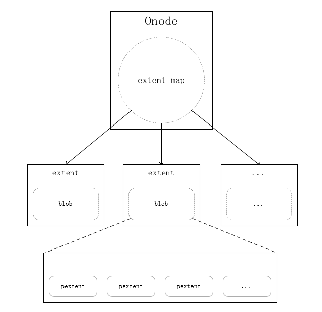
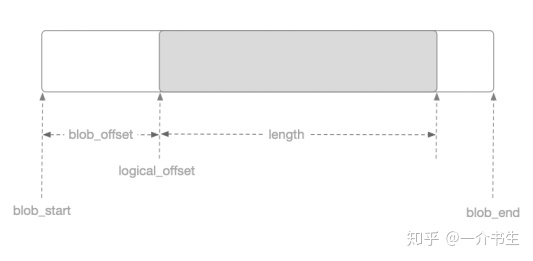
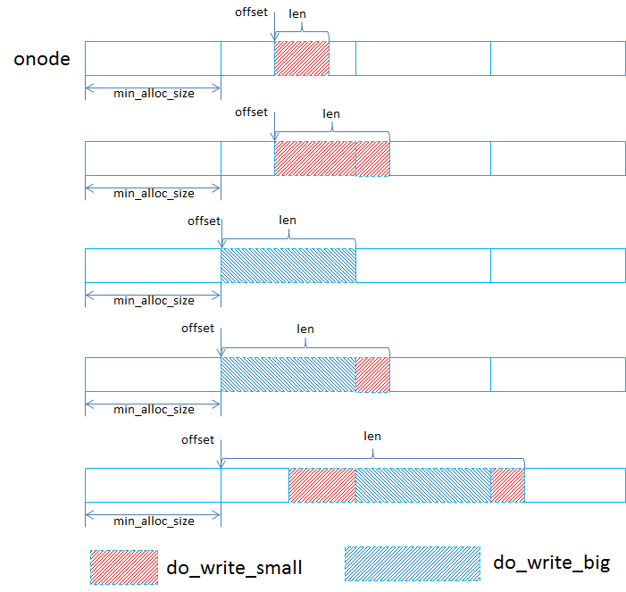
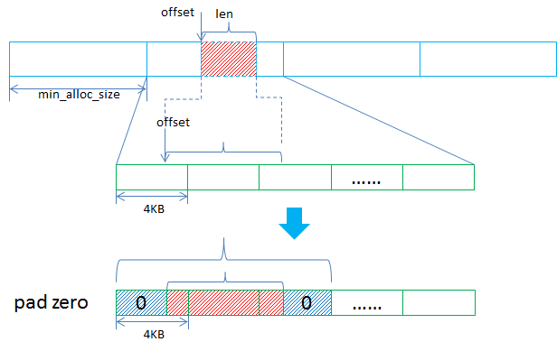
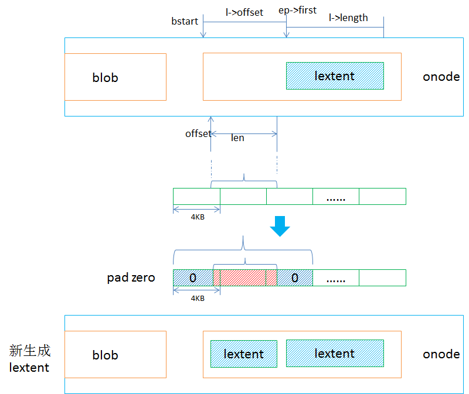
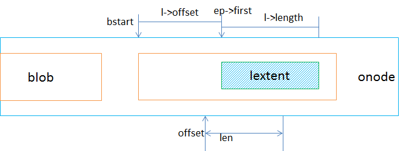
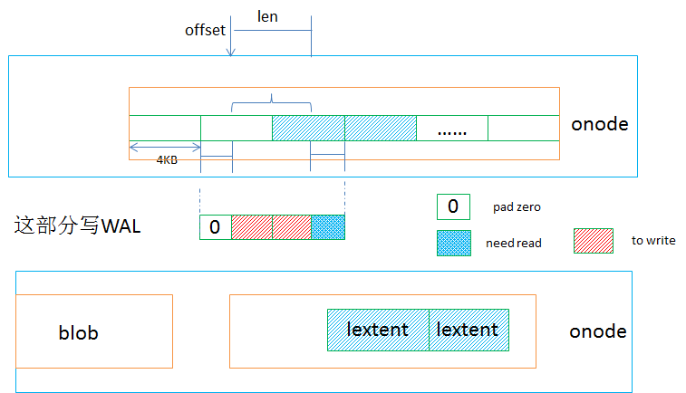
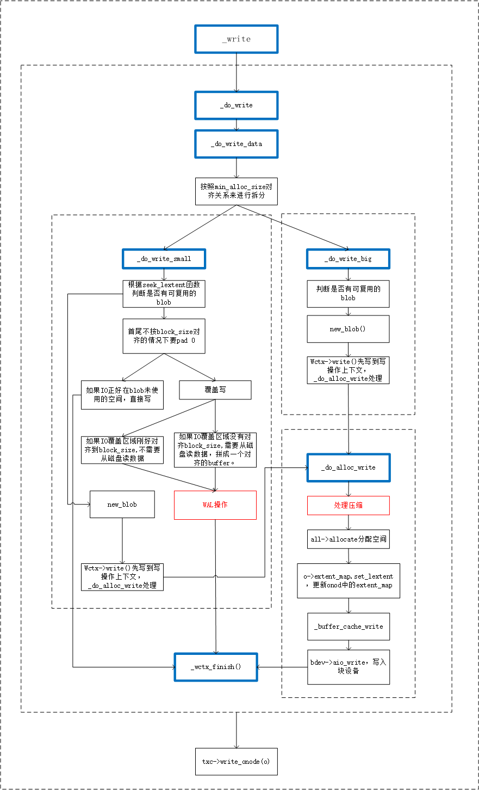

# bluestore 对象IO write

## 名词解释

- ``Collection`` : PG在内存的数据结构。
- ``bluestore_cnode_t`` : PG在磁盘的数据结构。
- ``Onode`` : 对象在内存的数据结构。
- ``bluestore_onode_t`` : 对象在磁盘的数据结构。
- ``Extent`` : 一段对象逻辑空间(lextent)。
- ``extent_map_t`` : 一个对象包含多段逻辑空间。
- ``bluestore_pextent_t`` : 一段连续的磁盘物理空间。
- ``bluestore_blob_t`` : 一片不连续的磁盘物理空间，包含多段pextent。
- ``Blob`` : 包含``bluestore_blob_t``、引用计数、共享blob等信息。

## bluestore相关数据结构

### Onode

```c++
//  ceph/src/os/bluestore/Bluestore.h
struct Onode{
    ...
    std::atomic_int nref;  ///< reference count 计数
    Collection *c;      // onode 对应的PG
    ghobject_t oid;     // Object信息
    bluestore_onode_t onode;  ///< metadata stored as value in kv store    onode磁盘数据结构
    bool exists;              ///< true if object logically exists
    ExtentMap extent_map;    // 映射lextents到blobs
    ...
}

```

通过Onode里的ExtentMap来查询Object数据到底层的映射。

onode结构图



### bluestore_onode_t

```c++
//  ceph/src/os/bluestore/bluestore_types.h
struct bluestore_onode_t {  
  uint64_t nid = 0;                    ///< numeric id (locally unique)  逻辑ID，单个BlueStore内部唯一。
  uint64_t size = 0;                   ///< object size  对象大小
  map<mempool::bluestore_cache_other::string, bufferptr> attrs;        ///< attrs 对象扩展属性
  ...
}
```


### bluestore_pextent_t

每段pextent对应一段连续的磁盘物理空间，结构体为`bluestore_pextent_t`。

```c++
//  ceph/src/os/bluestore/bluestore_types.h
struct bluestore_pextent_t {
  static const uint64_t INVALID_OFFSET = ~0ull;

  uint64_t offset = 0;    // 磁盘上的物理偏移
  uint32_t length = 0;    // 数据段的长度
  ...
}
```

pextent的offset和length都是块大小对齐的。

### LExtent

Extent是对象内的基本数据管理单元，数据压缩、数据校验、数据共享等功能都是基于Extent粒度实现的。这里的Extent是对象内的，并不是磁盘内的，所以我们称为lextent，和磁盘内的pextent以示区分。

```c++
//  ceph/src/os/bluestore/Bluestore.h 
struct Extent : public ExtentBase {
    ...
    uint32_t logical_offset = 0;      ///< logical offset  对应Object的逻辑偏移
    uint32_t blob_offset = 0;         ///< blob offset  对应Blob上的偏移
    uint32_t length = 0;              ///< length  数据段长度
    BlobRef  blob;                    ///< the blob with our data  指向对应Blob的指针
    ...
}
```

logical_offset、length、blob_offset关系如下图：



### Blob

Blob包含磁盘上物理段的集合，即`bluestore_pextent_t`的集合。

```c++
//  ceph/src/os/bluestore/Bluestore.h 
struct Blob {
    MEMPOOL_CLASS_HELPERS();
    std::atomic_int nref = {0};     ///< reference count  计数
    int16_t id = -1;                ///< id, for spanning blobs only, >= 0
    int16_t last_encoded_id = -1;   ///< (ephemeral) used during encoding only
    SharedBlobRef shared_blob;      ///< shared blob state (if any)  共享的blob状态
  private:
    mutable bluestore_blob_t blob;  ///< decoded blob metadata blob的元数据
    ...
}

struct bluestore_blob_t {
private:
  PExtentVector extents;              ///< raw data position on device 对应磁盘上的一组数据段
  uint32_t logical_length = 0;        ///< original length of data stored in the blob  blob的原始数据长度
  uint32_t compressed_length = 0;     ///< compressed length if any  压缩的数据长度
  ...
}
```


## I/O写映射逻辑

bluestore默认最小分配单元是``bluestore_min_alloc_size``，HDD默认是64KB，SSD默认是16KB。磁盘的块大小为

到达bluestore的I/O的offset和length都是对象内（onode）的，offset是相对于这个对象起始位置的偏移，在_do_write里首先就会根据最小分配单位min_alloc_size进行判断，从而将I/O分为对齐和非对齐的。如下图所示：



当一个写请求按照min_alloc_size进行拆分后，就会分为对齐写，对应到do_write_big，非对齐写（即落到某一个min_alloc_size区间的写I/O（对应到do_write_small）。

### do_write_big

对齐到min_alloc_size的写请求处理起来比较简单，有可能是多个min_alloc_size的大小，在处理时会根据实际大小新生成lextent和blob，这个lextent跨越的区域是min_alloc_size的整数倍，如果这段区间是之前写过的，会将之前的lextent记录下来便于后续的空间回收。

### do_write_small

在处理落到某个min_alloc_size区间的写请求时，会首先根据offset去查找有没有可以复用的blob，因为最小分配单元是min_alloc_size，默认64KB，如果一个4KB的写I/O就只会用到blob的一部分，blob里剩余的还能放其他的。

- 1. 没有找到可以复用的blob，新生成blob。



在处理还需要根据offset和len是否对齐到block_size（默认是4KB）进行补零对齐的操作，之所以需要补齐是与后续的写盘操作有关，真正写盘时有两种方式，一种是Direct I/O的方式，这种要求偏移和缓冲区都对齐的，另外一种非Direct I/O，即Buffered I/O，这种可以不对齐，但是是写到cache里，然后再sync刷到磁盘上，比如只写了100字节，在内核里是需要先从设备上读出来补齐成一个完整的扇区，然后再刷的，这样反而降低了效率。因此在bluestore里直接处理好对齐，对于后面的写盘来说比较有利，这里对齐到block_size，是个可配置的参数。

进行对齐补零时就是按照如上图那样把前后对齐到block_size，然后再把对齐后的offset和len作为lextent，进而放到blob里。 2. 找到可以复用的blob

对于可以复用的blob，也是先按照block_size进行对齐补零的动作，然后再判断是否可以直接使用blob里空闲的空间进行区分做不同的处理。

- 2. 找到可复用的blob

  - a. 直接写在blob未使用的空间上

    这种情况下直接新生成lextent放到blob里。

    

  - b. 覆盖写

    比如下面的这种情况，写I/O会覆盖部分已经写过的数据。



​			对于这种情况的处理如下图：也是需要先处理对齐补零的情况，如果覆盖的区域刚好是已经对齐到block_size，那么就不需要从磁盘读数据，但是如果覆盖的区域没有对齐到block_size，那么就需要把不对齐的那部分读出来，拼成一个对齐的buffer，然后新生成lextent，并且会对原来那个lextent进行调整，会记录需要回收的那部分区域。对于覆盖写的情况，都不是直接写盘，而是通过wal写到rocksdb。



###  整体写I/O流程图

### 


