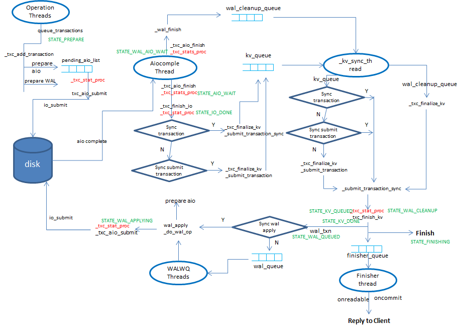

# bluestore 状态机

## 1. 整体流程

### 1.1 queue_transactios

queue_transactions是store统一的入口，各个存储引擎如filestore、kvstore、bluestore都得实现这个入口。在queue_transactions里先初始化transaction（初始化状态为STATE_PREPARE），然后在_txc_add_transaction 根据操作码的类型进行不同处理，将其放到transaction里，根据操作码OP_WRITE在BlueStore::_write里进行处理。BlueStore::_write –> BlueStore::_do_write –> (_do_write_small/_do_write_big) –> _do_alloc_write 分配空间，如果采用aio就会调用bdev->aio_write准备aio的结构，放在pending_aios里，如果不是aio就直接pwrite（如果是非direct的还需要sync）。

### STATE_PREPARE

确认该txc是否还有io需要提交到aio_thread，如果有，就调用_txc_aio_submit()提交到aio_queue中。
无论是否有需要提交的io，状态都会进入到STATE_AIO_WAIT。
回调函数aio_finish()在状态io完成后，会调用主流程函数，使流程继续执行。

### STATE_AIO_WAIT

确认该io是否还有前项依赖的io。如果有，返回，如果没有，进入下一个流程。该操作可确保io的顺序性，不使io产生乱序。

### STATE_IO_DONE

bluestore_sync_submit_transaction控制kv信息是否同步提交到kvdb中。
非同步提交，则状态变更为STATE_KV_QUEUED,同步提交，则变更会STATE_KV_SUBMITTED。

最终kv_sync_thread线程都会将txc放入到kv_committing_to_finalize中。

kv_finalize_thread从kv_committing_to_finalize获取txc，并使流程向下进行。
在这一过程中,wal也会被一起提交到kvdb中。

### STATE_KV_SUBMITTED

finisher的线程数，依据参数bluestore_shard_finishers, osd_op_num_shards, osd_op_num_shards_hdd,
osd_op_num_shards_ssd来控制。默认情况下，线程数为1。

将oncommits放入队列后，状态即变更为STATE_KV_DONE，流程不做停留，直接向下。

### STATE_KV_DONE

在构造txc时，会判断是否有deferred_txn，如果有，则说明需要写日志，没有，则直接到下一个状态。
deferred_txn存放着预写日志相关的数据。日志写入完成后，到此，所有的数据写入都完成。
txc存放到deferred_queue以作记录，同时存放到txc->osr->deferred_pending(DeferredBatch)
deferred_pending最后将通过aio或者同步方式写入到设备中。
aio回应后，调用DeferredBatch回调函数_deferred_aio_finish()，将deferred_pending中的deferred_txn
转存到deferred_done_queue中，经过kv_sync_thread，kv_finalize_thread数据从deferred_queue
-> deferred_done_queue -> deferred_stable_to_finalize。
最终txc变更为STATE_DEFERRED_CLEANUP，通过两个线程进入到下一个状态。

### STATE_DEFERRED_CLEANUP

一个短暂的状态，没有额外的操作，只是用于确认日志写入花费的时间。
到达该状态，流程即转到下一个状态。

### STATE_FINISHING

最后阶段。流程确认写入到设备中的操作完成，将修改在SharedBlob，释放不需要的内存数据

